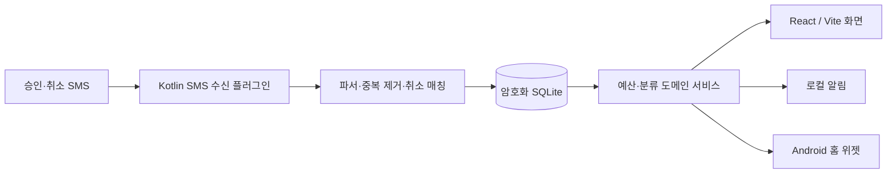

# 지원금 관리 모바일 앱 — 기술 설계

## 1. 기술 선택

| 계층 | 선택 | 이유 |
|---|---|---|
| 화면 | React + TypeScript + Vite | 빠른 화면 개발과 검증, 웹 기술 재사용 |
| 네이티브 컨테이너 | Capacitor | React 화면과 Android SMS·알림·위젯 API를 연결 |
| Android 네이티브 | Kotlin | SMS 수신, 로컬 알림, AppWidget/Glance 구현 |
| 상태 | Zustand | 작고 예측 가능한 화면 상태 |
| 검증 | Zod | SMS 파싱 결과와 사용자 입력의 런타임 검증 |
| 저장소 | 암호화 SQLite + Android Keystore | 오프라인 우선, 개인 지출 데이터 보호 |
| 배포 | 서명 APK | 초기 4명 직접 설치에 적합 |

Capacitor는 단순 웹 래퍼가 아니다. React 화면은 Capacitor 플러그인으로 Kotlin 기능을 호출하고, Kotlin이 SMS·위젯·알림을 처리한 뒤 정제된 거래 결과만 웹 화면에 전달한다.

## 2. 아키텍처



### 경계

- Kotlin: 권한 확인, SMS 수신, SMS 원문 즉시 폐기, 로컬 알림, 위젯 갱신
- TypeScript 도메인: 예산 계산, 정책 선택, 규칙 적용, 화면 상태
- SQLite: 거래·정책·규칙·변경 이력의 영속화
- 네트워크: v1에서 사용하지 않음

## 3. 데이터 모델

### 주요 엔터티

| 엔터티 | 핵심 필드 |
|---|---|
| Profile | id, displayName, allowedCardLast4, timezone, createdAt |
| PolicyVersion | id, profileId, effectiveFrom, effectiveTo, residentCap, studyCap, totalCap, status |
| CategoryBudget | id, policyVersionId, bucket, category, plannedAmount, thresholdLow, thresholdHigh |
| Transaction | id, profileId, occurredAt, amount, merchantRaw, merchantNormalized, cardLast4, approvalCode, status, classificationState, source |
| TransactionAllocation | transactionId, policyVersionId, bucket, category, amount |
| ClassificationRule | id, profileId, matchType, merchantNormalized, amountNullable, bucket, category, priority, active |
| CancellationLink | originalTransactionId, cancellationTransactionId, cancelledAmount, matchedBy |
| AuditLog | id, profileId, action, entityType, entityId, beforeJson, afterJson, createdAt |

### 상태 정의

| 대상 | 상태 |
|---|---|
| 거래 | approved, partially_cancelled, cancelled, cancellation_needs_review, excluded |
| 분류 | classified, unclassified, manually_unclassified, excluded |
| 정책 | scheduled, active, closed |

### 계산 원칙

- `총 사용액` = 현재 정책 기간의 취소되지 않은 승인 거래 전체 합계. 미정도 포함.
- `지원구분 사용액` = 해당 지원구분으로 배정된 거래 합계. 미정·제외는 제외.
- `카테고리 사용액` = 해당 카테고리로 배정된 거래 합계.
- `잔액` = 정책 한도 - 사용액. 음수도 표시하여 초과를 숨기지 않는다.

## 4. SMS 처리 계약

### 입력과 출력

Kotlin 파서는 카드사·은행의 고정 형식을 읽어 아래 구조만 WebView 쪽에 전달한다.

```ts
type ParsedSmsEvent = {
  kind: 'approval' | 'cancellation'
  occurredAt: string
  amount: number
  merchantRaw: string
  cardLast4: string
  approvalCode?: string
}
```

원문, 발신 전화번호, 본문 전체는 데이터베이스·로그·분석 도구에 저장하지 않는다.

### 처리 순서

1. 권한·카드 끝 4자리 필터를 통과한 SMS만 파싱한다.
2. 파싱 결과를 Zod로 검증한다. 실패하면 원문 없이 실패 횟수만 기록한다.
3. 중복 여부를 검사한다.
4. 승인에는 분류 규칙을 적용하고, 없으면 미정으로 기록한다.
5. 취소에는 최근 60일 승인 건을 매칭한다. 실패 시 취소 확인 필요로 기록한다.
6. 해당 정책 버전의 집계를 재계산한다.
7. 새 임계치·초과 여부를 판정하고 로컬 알림·위젯을 갱신한다.

## 5. 핵심 알고리즘

### 정책 선택

`effectiveFrom <= occurredAt <= effectiveTo`인 정책 버전을 우선 사용한다. 동일 시각에 두 버전이 있으면 생성 시간이 최신인 버전을 선택하지 않고 데이터 무결성 오류로 막는다.

### 분류 우선순위

1. 사용자가 한 번만 지정한 수동 분류
2. 상호명+금액 규칙
3. 상호명 전체 규칙
4. 미정

### 취소 매칭

1. 승인번호가 있으면 카드 끝 4자리 + 승인번호 우선
2. 없으면 카드 끝 4자리 + 동일 금액 + 정규화 상호명 + 최근 60일
3. 복수 후보면 자동 매칭하지 않고 취소 확인 필요로 이동
4. 원 결제보다 큰 취소금액은 자동 반영하지 않고 검토 대상으로 이동

## 6. Android 네이티브 설계

### 권한과 온보딩

- `READ_SMS` 권한 요청 전: 목적, 카드 끝 4자리 필터, 원문 미저장, 권한 해제 방법을 설명한다.
- 권한 거부 시: 수동 결제 입력과 수동 SMS 붙여넣기는 계속 제공한다.
- 알림 권한도 별도로 요청하고 거부 시 인앱 경고만 제공한다.

### 위젯

- AppWidget 또는 Glance 기반.
- 앱 DB의 요약 스냅샷만 읽는다.
- 거래 처리·정책 변경·미정 건 변경 때 즉시 갱신하고, 일 1회 보정 갱신한다.

## 7. 보안·백업

- DB 키는 Android Keystore에 보호한다.
- 민감값은 앱 로그·크래시 리포트에 포함하지 않는다.
- 내보내기 파일은 암호화하고, 비밀번호 복구 기능은 v1에 제공하지 않는다.
- 앱 삭제 전 내보내기를 권장하되 자동 클라우드 업로드는 하지 않는다.

## 8. 배포·운영

1. 내부 테스트용 debug APK로 SMS 파싱과 위젯을 검증한다.
2. release keystore로 서명한 APK를 생성한다.
3. 4명에게 직접 설치하고 각 사용자별 카드 끝 4자리·초기 정책을 설정한다.
4. 오류 보고는 SMS 원문이 아닌 마스킹된 파싱 결과와 앱 버전만 수집한다.
5. 스토어 출시 전에는 SMS 권한 정책·개인정보 고지·서명키 보관 절차를 별도로 검토한다.

## 9. 구현 전 입력물

- 같은 카드사 승인 SMS 1건과 취소 SMS 1건: 이름·금액·번호 등 개인정보를 가린 샘플
- 사용자별 카드 끝 4자리
- Android 최소 지원 버전 및 테스트 기기 목록
- APK 전달 방식과 각 사용자의 설치 가능 여부
