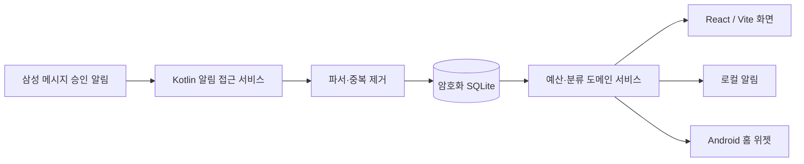

# 지원금 관리 모바일 앱 — 기술 설계

## 1. 기술 선택

| 계층 | 선택 | 이유 |
|---|---|---|
| 화면 | React + TypeScript + Vite | 빠른 화면 개발과 검증, 웹 기술 재사용 |
| 네이티브 컨테이너 | Capacitor | React 화면과 Android 알림 접근·위젯 API를 연결 |
| Android 네이티브 | Kotlin | 삼성 메시지 알림 처리, 로컬 알림, AppWidget 구현 |
| 상태 | React 상태 + 순수 TypeScript 도메인 모듈 | 화면 상태와 계산 규칙을 분리해 테스트 |
| 검증 | Kotlin/TypeScript 명시적 검증 함수 | 승인 알림 파싱 결과와 사용자 입력을 경계에서 검증 |
| 저장소 | 암호화 SQLite + Android Keystore | 오프라인 우선, 개인 지출 데이터 보호 |
| 배포 | 서명 AAB/APK | Google Play 공개 배포와 실기기 검증 지원 |

Capacitor는 단순 웹 래퍼가 아니다. React 화면은 Capacitor 플러그인으로 Kotlin 기능을 호출하고, Kotlin이 삼성 메시지 알림·위젯·로컬 알림을 처리한 뒤 정제된 거래 결과만 웹 화면에 전달한다.

## 2. 아키텍처



### 경계

- Kotlin: 알림 접근 확인, 삼성 메시지 승인 알림 처리, 원문 즉시 폐기, 로컬 알림, 위젯 갱신
- TypeScript 도메인: 예산 계산, 정책 선택, 규칙 적용, 화면 상태
- SQLite: 거래·정책·규칙·변경 이력의 영속화
- 네트워크: v1에서 사용하지 않음

### 화면·라이브러리 로딩 경계

- 최초 화면은 앱 셸과 대시보드에 필요한 코드만 읽는다.
- 온보딩, 거래 가져오기, 백업·복원, 증빙 PDF 화면은 화면 진입 시 동적 로드한다.
- `xlsx`와 `pdf-lib`도 해당 기능을 실행할 때 APK 내부 청크에서 읽는다. 첫 실행에는 짧은 로딩이 생길 수 있지만 네트워크 요청은 없다.
- `App.tsx`는 화면 전환과 상태 연결을 담당하고, 대시보드와 기능 화면은 `features` 단위 컴포넌트가 담당한다.

## 3. 데이터 모델

### 주요 엔터티

| 엔터티 | 핵심 필드 |
|---|---|
| Profile | id, displayName, allowedCardLast4, timezone, createdAt |
| PolicyVersion | id, profileId, effectiveFrom, effectiveTo, residentCap, studyCap, totalCap, status |
| CategoryBudget | id, policyVersionId, bucket, category, plannedAmount, thresholdLow, thresholdHigh |
| Transaction | id, profileId, occurredAt, amount, merchantRaw, merchantNormalized, cardLast4, approvalCode, status, classificationState, source |
| TransactionAllocation | transactionId, policyVersionId, bucket, category, amount |
| ClassificationRule | id, profileId, matchType, merchantNormalized, amountNullable, bucket, category, priority, active |
| CancellationLink | originalTransactionId, cancellationTransactionId, cancelledAmount, matchedBy |
| AuditLog | id, profileId, action, entityType, entityId, beforeJson, afterJson, createdAt |

### 상태 정의

| 대상 | 상태 |
|---|---|
| 거래 | approved, partially_cancelled, cancelled, cancellation_needs_review, excluded |
| 분류 | classified, unclassified, manually_unclassified, excluded |
| 정책 | scheduled, active, closed |

### 계산 원칙

- `총 사용액` = 현재 정책 기간의 취소되지 않은 분류 완료 승인 거래 합계. 미정·제외는 포함하지 않는다.
- `지원구분 사용액` = 해당 지원구분으로 배정된 거래 합계. 미정·제외는 제외.
- `카테고리 사용액` = 해당 카테고리로 배정된 거래 합계.
- `잔액` = 정책 한도 - 사용액. 음수도 표시하여 초과를 숨기지 않는다.

## 4. 승인 알림 처리 계약

### 입력과 출력

Kotlin 파서는 카드사·은행의 고정 형식을 읽어 아래 구조만 WebView 쪽에 전달한다.

```ts
type ParsedApprovalEvent = {
  kind: 'approval'
  occurredAt: string
  notificationPostedAt?: number
  amount: number
  merchantRaw: string
  cardLast4: string
  approvalCode?: string
}
```

원문, 발신 전화번호, 본문 전체는 데이터베이스·로그·분석 도구에 저장하지 않는다.

### 처리 순서

1. 알림 접근에서는 삼성 메시지·신한 SOL·신한카드의 허용 패키지만 처리하고 그룹 요약은 제외하며 카드 끝 4자리 필터를 적용한다.
2. 묶음 대화 알림은 메시지 배열을 시간순으로 순회하고 각 본문을 독립적으로 파싱한다.
3. 파싱 결과를 검증한다. 실패하면 원문 없이 실패 횟수만 기록한다.
4. 거래시각·상호명·금액·메시지 게시 시각(밀리초)으로 출처 ID를 만들고 같은 앱의 수신 이벤트만 제외한다. 서로 다른 허용 앱에서 5분 안에 같은 승인 키가 수신되면 하나로 합친다.
5. 승인에는 분류 규칙을 적용하고, 없으면 미정으로 기록한다.
6. 해당 정책 버전의 집계를 재계산한다.
7. 새 임계치·초과 여부를 판정하고 로컬 알림·위젯을 갱신한다.

### 승인 알림 접근

- `NotificationListenerService`는 삼성 메시지(`com.samsung.android.messaging`), 신한 SOL(`com.shinhan.sbanking`), 신한카드(`com.shinhancard.smartshinhan`)만 처리한다. 다른 앱 알림은 즉시 무시한다.
- 알림 접근이 처음 연결되거나 다시 연결되면 현재 활성 상태인 허용 앱의 알림도 한 번 검사해 권한 허용 전 수신된 묶음 알림을 복구한다.
- `MessagingStyle` 메시지 배열이 있으면 각 메시지의 내부 밀리초 시각을 사용한다. 배열이 없으면 확장 본문과 `notification.when`을 사용한다.
- 원본 승인 알림은 취소하지 않는다.
- 파싱 성공 후 앱이 생성한 승인·예산 경고 알림은 클릭 시 대시보드를 열고 자동으로 닫힌다.
- 같은 대화 알림이 `[A]`에서 `[A, B]`로 갱신되면 A의 출처 ID는 이미 처리된 값이므로 B만 추가한다.

### 수신 대기열 동기화

- 네이티브 수신기는 앱 화면이 닫혀 있어도 정제된 승인 건을 암호화 대기열에 넣는다.
- 앱이 열려 있으면 수신 이벤트로 즉시 가져오고, 앱 시작·화면 복귀 때도 대기열을 한 번 확인한다.
- 2초 같은 고정 폴링은 사용하지 않는다. 사용자가 앱을 열 때의 동기화는 로컬 저장소 조회이므로 일반적으로 체감 대기 없이 끝난다.

## 5. 핵심 알고리즘

### 정책 선택

`effectiveFrom <= occurredAt <= effectiveTo`인 정책 버전을 우선 사용한다. 동일 시각에 두 버전이 있으면 생성 시간이 최신인 버전을 선택하지 않고 데이터 무결성 오류로 막는다.

- 기간 키는 한국 시간 기준 시작 월을 사용한다. 예: `2026-08`은 2026-08-14 00:00부터 2026-09-10 23:59:59까지다.
- 11~13일 거래는 저장하지만 기간 집계 함수가 명시적으로 제외한다.
- 기존 거래의 저장된 `periodKey`가 과거 10일 기준으로 생성됐더라도 조회 시 `occurredAt`으로 다시 계산해 데이터 삭제 없이 새 규칙을 적용한다.

### 분류 우선순위

1. 사용자가 한 번만 지정한 수동 분류
2. 상호명+금액 규칙
3. 상호명 전체 규칙
4. 미정

### 취소 매칭

아래 기준은 실제 취소 알림 샘플 확보 후 구현할 후속 설계다. 현재 버전은 사용자의 수동 취소 확정만 지원한다.

1. 승인번호가 있으면 카드 끝 4자리 + 승인번호 우선
2. 없으면 카드 끝 4자리 + 동일 금액 + 정규화 상호명 + 최근 60일
3. 복수 후보면 자동 매칭하지 않고 취소 확인 필요로 이동
4. 원 결제보다 큰 취소금액은 자동 반영하지 않고 검토 대상으로 이동

## 6. Android 네이티브 설계

### 권한과 온보딩

- 최초 실행에서 삼성 메시지 알림 접근의 목적, 카드 끝 4자리 필터, 원문 미저장, 시스템 해제 방법을 설명한다.
- 알림 접근 거부 또는 중단 시 신한카드 엑셀 가져오기와 수동 결제 입력을 제공한다.
- 앱 자체 알림 권한은 별도로 요청하며, 거부 시 인앱 경고만 제공한다.
- 병합된 매니페스트에 `READ_SMS`와 `RECEIVE_SMS`가 없어야 한다.

### 위젯

- AppWidget 또는 Glance 기반.
- 앱 DB의 요약 스냅샷만 읽는다.
- 거래 처리·정책 변경·미정 건 변경 때 즉시 갱신하고, 일 1회 보정 갱신한다.

## 7. 보안·백업

- 거래·정책·분류 규칙의 기준 저장소는 SQLCipher 암호화 SQLite 하나로 둔다. DB 비밀값은 Android Keystore로 보호한다.
- SQLite 내부는 `app_settings`, `ledger_entries`, `policy_versions`, `merchant_rules`로 정규화한다. 거래·정책·규칙은 변경된 행만 트랜잭션으로 갱신한다.
- 기존 `app_state` 단일 스냅샷은 새 테이블 저장이 커밋된 후에만 삭제한다. 마이그레이션 실패 시 기존 행을 보존하고 다음 실행에서 재시도한다.
- 기존 `localStorage` 데이터는 암호화 저장과 재조회가 성공한 후에만 지우며, 이후 Android에서는 평문 저장소로 폴백하지 않는다.
- 카드 끝 4자리와 미처리 승인 알림 대기열은 Keystore 기반 암호화 설정 저장소에 둔다. 위젯 설정에는 표시용 합계만 저장한다.
- 민감값은 앱 로그·크래시 리포트에 포함하지 않는다.
- 내보내기 파일은 암호화하고, 비밀번호 복구 기능은 v1에 제공하지 않는다.
- 백업과 증빙 PDF는 MediaStore를 통해 `Downloads/신청해 계산기`에 직접 저장한다. 공유 화면은 열지 않는다.
- 앱 삭제 전 내보내기를 권장하되 자동 클라우드 업로드는 하지 않는다.
- 직전 실행이 사용자 강제 종료였으면 다음 실행에서 자동 수신 누락 가능성과 엑셀 가져오기 복구 경로를 안내한다.

## 8. 배포·운영

1. 내부 테스트용 debug APK로 삼성 메시지 알림 파싱과 위젯을 검증한다.
2. release keystore로 서명한 APK를 생성한다.
3. 4명에게 직접 설치하고 각 사용자별 카드 끝 4자리·초기 정책을 설정한다.
4. 오류 보고는 원문 알림이 아닌 마스킹된 파싱 결과와 앱 버전만 수집한다.
5. Play 출시 전 알림 접근 고지·개인정보처리방침·Data safety·서명키 보관 절차를 검토한다.

### 지원 범위

- 최소 OS는 Android 10(API 29), target/compile SDK는 36이다.
- OS 버전은 파일 저장·권한·보안 API의 기능 하한을 정하는 1차 기준이다.
- ABI는 별도 하드웨어 기준이다. 현재는 테스트 기기 호환성을 위해 범용 APK를 유지하고, 초기 사용자 기기가 모두 64비트 ARM임을 확인한 뒤 release만 `arm64-v8a`로 축소한다.
- iOS는 Android 안정화 이후 별도 제품 흐름으로 설계한다. iOS에서는 승인 SMS 자동 수집을 그대로 이식할 수 없다.

## 9. 구현 전 입력물

- 같은 카드사 승인 알림 1건과 취소 알림 1건: 이름·금액·번호 등 개인정보를 가린 샘플
- 사용자별 카드 끝 4자리
- Android 최소 지원 버전 및 테스트 기기 목록
- APK 전달 방식과 각 사용자의 설치 가능 여부

### 6.1 파일 가져오기 카드 연결

1. 사용자가 설정한 카드 끝 4자리에서 비교용 앞 3자리를 만든다.
2. 신한카드 엑셀 파서가 제공한 카드 식별값을 정규화해 앞 3자리를 비교한다. 은행 PDF는 카드 식별값이 없어 가져오기 대상에서 제외한다.
3. 일치 행만 가져오고, 그 외 행은 `다른 카드 제외`로 집계한다.
4. 같은 앞 3자리에 대해 서로 다른 `cardIdentity`가 둘 이상이면 가져오기를 거절한다.
5. 카드 식별값이 마스킹되어 중복 물리 카드를 판별할 수 없으면 비차단 안내를 노출한다.
6. 통과한 행의 `cardLast4`에는 사용자가 설정한 정확한 4자리를 연결한다. 전체 PAN·원문 알림은 저장하지 않는다.
